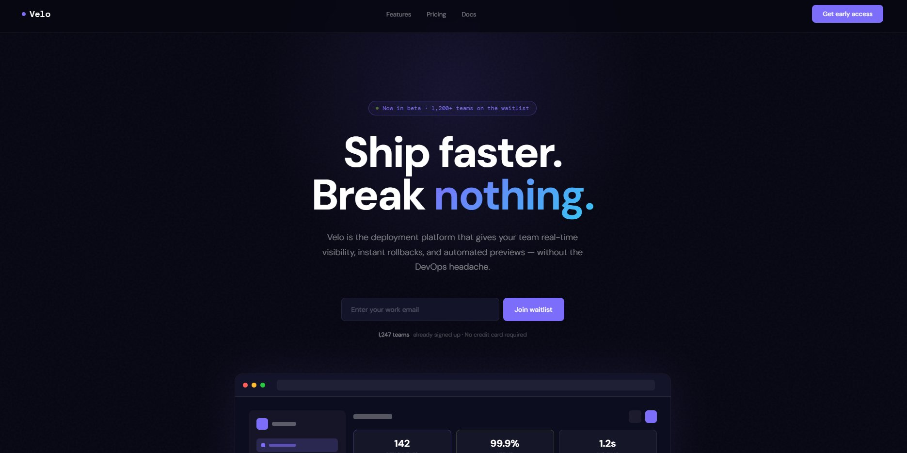
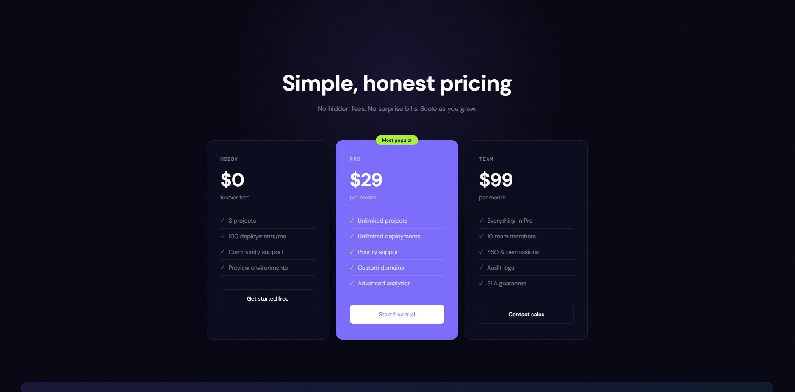

# Velo — SaaS Startup Landing Page

A high-converting dark-mode landing page for a fictional SaaS deployment platform. Built with a waitlist form, animated app dashboard preview, features grid, and a 3-tier pricing section.



---

## Live Demo

🔗 [johank-portfolio-startup.netlify.app](https://johank-portfolio-startup.netlify.app/)

---

## About

Velo is a concept landing page designed for a B2B SaaS product targeting engineering teams. The goal was to communicate trust, speed, and simplicity, the three things that matter most to developers evaluating a new tool. The dark aesthetic, bold typography, and live dashboard mockup all serve that goal.

---

## Screenshots



---

## Features

- Animated hero badge with pulsing live indicator
- Email waitlist capture form
- Interactive app dashboard UI mockup
- 6-card features grid with hover effects
- 3-tier pricing cards with highlighted popular plan
- Noise texture and radial glow background effects
- Fully responsive across all screen sizes

---

## Tech Stack

| Technology | Purpose |
|---|---|
| HTML5 | Structure and content |
| CSS3 | Dark theme, animations, layout |
| JavaScript | Scroll reveal, smooth navigation |
| Google Fonts | DM Sans + DM Mono typefaces |

---

## Getting Started

```bash
git clone https://github.com/johank/startup-landing-page.git
open index.html
```

---

## Contact

Built by **Johan K**
📧 [johank.dev1@gmail.com](mailto:johank.dev1@gmail.com)
🌐 [johank.netlify.app](https://johank.netlify.app)
